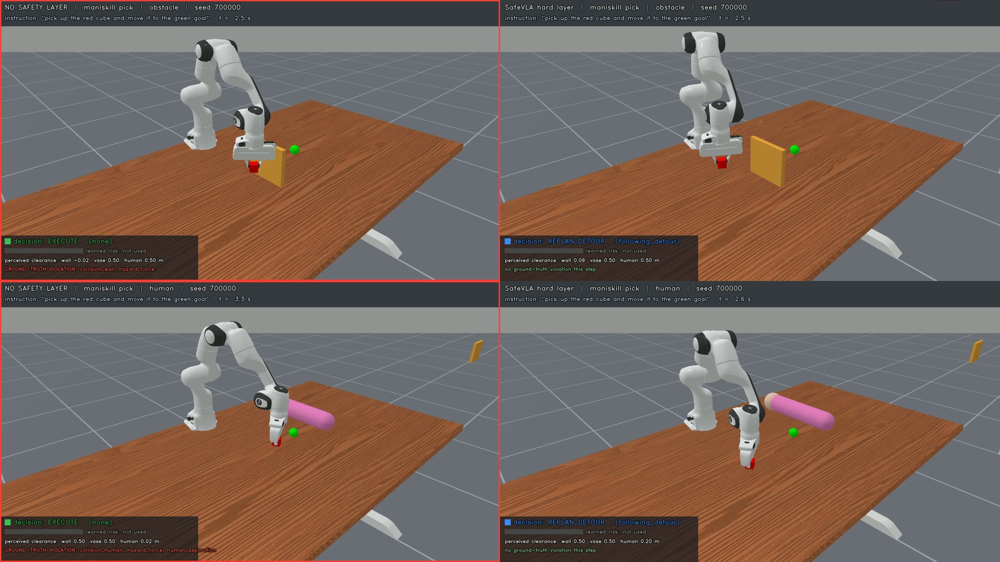
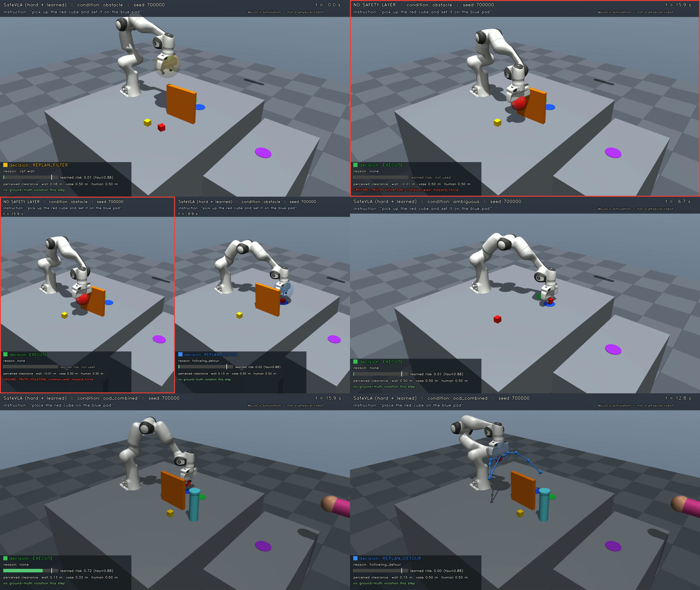

# SafeVLA

**A runtime safety layer for vision-language-action (VLA) robot policies.**
It wraps any base manipulation policy and filters every command. A hard layer (control-barrier-function
QP, speed and separation monitoring, detour planner, instruction checks) sits beside a learned layer
(risk ensemble with a conformal threshold). An arbiter picks one of EXECUTE, REPLAN_FILTER,
REPLAN_DETOUR, SAFE_STOP, ABORT, REFUSE or REQUEST_CLARIFICATION.

The same layer is evaluated on three benchmarks:

| Benchmark | Base policy | Status |
|---|---|---|
| **v4: custom MuJoCo 3.3.5 scene** (Menagerie Franka Panda) | BC + DAgger action-chunk ensemble | complete, 1,350 paired test episodes |
| **ManiSkill 3**: PickCube / StackCube with injected hazards | BC + DAgger action-chunk ensemble | complete, 1,440 paired test episodes |
| **LIBERO-Spatial**: 10 tasks with injected hazards | **pretrained OpenVLA-7B** (`openvla-7b-finetuned-libero-spatial`) | running (see [status](#libero--openvla-7b-in-progress)) |

> **Simulation only.** No physical robot, sensor or person was involved. The "human" is a kinematic
> forearm proxy, and separation thresholds are illustrative, not certified ISO/TS 15066 values.


*ManiSkill, same seed. Left: base policy alone collides with the wall (top) and the human (bottom).
Right: with the hard layer, it detours and completes the task. Overlays show the layer's decision,
perceived clearances and the simulator's ground-truth violation monitor.*

---

## Results

### ManiSkill 3 (PickCube + StackCube, 6 conditions × 30 seeds, 360 episodes per method)

| Method | Success | Unsafe episodes | Collision onsets | Mean peak hazard force |
|---|---|---|---:|---:|
| none (base policy) | 51% (46–56) | 82% (77–85) | 574 | 166 N |
| learned risk only | 39% (34–44) | 37% (32–42) | 155 | 10.4 N |
| **hard layer** | **92% (89–95)** | **1.1% (0–3)** | 4 | 0.9 N |
| combined (hard + learned) | 79% (75–83) | **0% (0–1)** | 0 | 0 N |

95% Wilson intervals; paired exact McNemar tests on identical seeds:
- hard vs none: more successful on 154 vs 4 episodes (p = 1e-40), safer on 290 vs 0 (p = 1e-87);
- combined vs hard: safer on 4 vs 0 episodes (p = 0.125, n.s.), but hard is more successful on 47 vs 0 (p = 1e-14).

Full tables: [`reports/safebench_maniskill.md`](reports/safebench_maniskill.md).

### v4: custom MuJoCo benchmark (9 conditions, including instruction safety and a held-out OOD scene)

| Method (270 episodes each) | Success (feasible tasks) | Unsafe episodes¹ | Unsafe / impossible instructions refused |
|---|---|---|---|
| none (base VLA) | 36% | 63% | 0/60 |
| learned risk only | 36% | 55% | 5/60 |
| **hard layer** | **82%** | **1.9%** | **60/60** |
| combined_v1 (hard + learned) | 60% | 0.7% | 60/60 |
| combined (gated arbiter) | 70% | 3.0% | 60/60 |

¹ Corrected for a disclosed simulator artefact (vase creep); the uncorrected values and the audit are in
[`reports/SAFEVLA_FINAL.md`](reports/SAFEVLA_FINAL.md).



### Findings (consistent across both completed benchmarks)

1. **The hard layer does the heavy lifting.** It removes almost all violations and *raises* task
   success: the detour planner gets the policy around obstacles it would otherwise crash into.
   Ablations on v4 show the detour planner and speed-and-separation monitoring are each necessary.
2. **Learned risk is a decent detector but a poor controller.** On its own it still lets 37–55% of
   episodes turn unsafe and converts many runs into aborts.
3. **Conformal guarantees do not survive the layer's own distribution shift.** On ManiSkill the risk
   model reaches AUROC 0.999 and ECE 0.005 on calibration data, but only AUROC 0.83 and ECE 0.21 at test
   time. The risk data came from the base policy, with or without the hard layer; at test time the learned
   and combined layers change the state distribution. On the held-out OOD scene the combined arbiter then
   over-stops (Pick 97% → 23% success) for a non-significant safety gain. v4 showed the same effect
   (conformal FNR 10% → 44%). Calibrating on rollouts of the deployed layer is the obvious next step.
4. **Success rate can hide unsafe behaviour.** In ManiSkill's fragile-vase scenes the base policy
   completes 98% of tasks while knocking the vase over in 90% of them.

### LIBERO + OpenVLA-7B (in progress)

OpenVLA-7B (fp16, V100) runs as the unmodified base policy. OSC actions are mapped to end-effector
twists through a MuJoCo kinematic twin of the Panda, with gains calibrated at 0.260 m/s and
2.184 rad/s per unit action. The twist is filtered by the same layer and mapped back.

Status:
- **Readiness check:** OpenVLA succeeded on 5 of 6 clean-scene episodes, at about 276 ms per action.
- **Bug found and fixed:** a pre-evaluation check found phantom hazards in clean scenes. robosuite
  renders segmentation with multisampling, so object-edge pixels decode to arbitrary geometry IDs, some of
  them the hazards'. The fix keeps a hazard label only when a pixel's neighbours agree and cuts depth at
  2.5 m ([`bench/safebench/libero_bench.py`](bench/safebench/libero_bench.py)).
- **Rerun:** all LIBERO data collected before the fix was discarded and the run restarted
  (queue `safebench_libero_v3`). Results will be added here when it finishes.

---

## How it works

```
RGB-D cameras ─► hazard perception ─► point clouds (wall / fragile vase / human)
instruction ───► parse + ground ─────► REFUSE / REQUEST_CLARIFICATION / task      (v4)
                                   │
            base policy (BC/DAgger ensemble, or OpenVLA-7B) ─► proposed action
                                   │
      ┌────────────────────────────┴─────────────────────────────┐
  HARD LAYER                                               LEARNED LAYER
  CBF-QP over 13 robot spheres vs perceived clouds         5-MLP risk ensemble on perception,
  + joint / velocity / acceleration / workspace barriers   proprioception and the proposed action
  + speed & separation monitoring near the human           temperature scaling, split-conformal τ
  + wavefront detour planner when the filter deadlocks     (target FNR 10%); labels from
  + instruction checks (unsafe target, reachability)       counterfactual rollouts (state save/restore)
      └───────────────────────────► ARBITER ◄────────────────────┘
                                   │
               simulator physics + ground-truth safety monitor (contacts, forces,
               human separation, vase displacement); the layer never sees it
```

**Porting to other simulators.** A MuJoCo kinematic twin of the Menagerie Panda is synced to the
benchmark robot's joints (zero joint error on ManiSkill and robosuite). The shield runs in a task
frame with its origin on the table under the robot base, so the same CBF, planner and risk features
work unchanged. The adapters live in `bench/safebench/*_bench.py`.

**Protocol.** Test seeds are disjoint from demonstration, DAgger, risk-training and calibration seeds.
Every method sees the identical seed, scene and instruction (paired design). The held-out OOD scene
(rotated wall + vase + human + dim light + camera extrinsic error) is never used for fitting.
Safety is judged only by the simulator's ground truth.

---

## Videos (1920×1080, 60 fps)

| ManiSkill (`videos/maniskill/`) | v4 (`videos/v4_v2/`) |
|---|---|
| `ms_demo_success.mp4`: hard layer through wall, vase and human scenes | `demo_success.mp4` |
| `ms_unsafe_without_layer.mp4`: base policy collisions | `unsafe_without_shield.mp4` |
| `ms_prevented_side_by_side.mp4`: same seed, with vs without | `prevented_by_safevla.mp4` |
| `ms_failure_cases.mp4`: honest failures (sensor corruption, OOD) | `failure_cases.mp4`, `ood_cases.mp4`, `instruction_safety.mp4` |

Clips are chosen by a fixed rule (lowest qualifying test seed, failures included), recorded in each
folder's `selection_manifest.json`, and replayed from stored simulator states.

---

## Repository layout

```
src/safevla/          v4 core: scene, env + conditions, perception, language, expert/policy,
                      shield (CBF-QP, SSM, detour planner), risk (ensemble, conformal), runtime, report, render
bench/                benchmark ports
  run_maniskill.py    ManiSkill pipeline: smoke → demos → bc → dagger → riskdata → risk → evaluate → report → render → verify
  run_libero.py       LIBERO pipeline:    calibrate → smoke → riskdata → risk → evaluate → report → render → verify
  openvla_libero.py   OpenVLA-on-LIBERO glue (vendored from openvla/openvla, MIT)
  safebench/          twin, layer, perception, hazards, episode loop, adapters, report, renderers
scripts/
  safevla_v4.py       v4 pipeline (all stages)
  background_pipeline.py  resumable stage queue (heartbeat, timeouts, per-stage interpreter)
  remote/             headless GPU-server setup, launch, status and rehearsal scripts
  vase_creep_analysis.py, dev_*.py   audits and debugging tools used during development
experiment_tracking/  queue definitions (*.json) for every run reported here
tests/                13 unit/integration tests for v4
assets/franka_emika_panda/   MuJoCo Menagerie Panda (Apache-2.0, unmodified)
data/v4/              scripted-expert demonstrations used to train the v4 base policy
results/              per-episode CSVs, summaries, verification (v4_v2, maniskill)
figures/  videos/  reports/
```

**Not included:** model checkpoints (`checkpoints/` is git-ignored; every pipeline regenerates
them), per-episode trace and state files, and risk-training arrays. These stay on the compute server
and are not needed for any table or video here.

---

## Reproducing

### v4 (any Linux machine; CPU is enough, a GPU speeds up rendering)

```bash
python3.12 -m venv .venv && .venv/bin/pip install -r requirements.txt
MUJOCO_GL=egl .venv/bin/python -m pytest tests            # 13 tests
MUJOCO_GL=egl .venv/bin/python scripts/safevla_v4.py smoke   # quick end-to-end check
# full queue, detached, on a headless server:
bash scripts/remote/setup.sh && bash scripts/remote/launch.sh "" safevla_v4
bash scripts/remote/status.sh safevla_v4
```

### ManiSkill 3 and LIBERO + OpenVLA (Linux + NVIDIA GPU; OpenVLA needs ≥ 17 GB free per worker)

```bash
bash scripts/remote/setup_benchmarks.sh all        # two conda envs + LIBERO/OpenVLA clones + OpenVLA weights
bash scripts/remote/bench_rehearsal_v2.sh all      # tiny end-to-end run of every stage (*_dry outputs)
bash scripts/remote/launch.sh 8 safebench_maniskill
bash scripts/remote/launch.sh 8 safebench_libero_v3
bash scripts/remote/status.sh safebench_maniskill
```

The environments are pinned in `scripts/remote/setup_benchmarks.sh`:
- ManiSkill 3.0.1 with torch 2.4.1;
- LIBERO with robosuite 1.4.1, MuJoCo 3.1.6, torch 2.2.0 and transformers 4.40.1.

Measured on the development server (2× V100):
- ManiSkill: about 1 h 55 min end to end.
- LIBERO: about 2 min per OpenVLA episode per GPU.

---

## Limitations and disclosures

- The CBF acts on a 13-sphere robot approximation at 20–25 Hz; it is a filter, not a formal guarantee.
- Hazard perception uses real depth images with **oracle segmentation** (simulator geometry IDs).
  Realistic segmentation is untested.
- On v4 and ManiSkill the base policy is a small BC/DAgger ensemble trained from a scripted expert, not
  a pretrained VLA. The LIBERO run exists to test a real VLA.
- v4 language grounding is a keyword grammar, not a pretrained VLM.
- The learned-layer arbiter gain was tuned on v4 sweep seeds (κ = 0.04) and not re-tuned per benchmark.
- v4 went through three evaluation rounds. Bugs found in earlier rounds and the vase-creep artefact
  are documented in [`reports/SAFEVLA_FINAL.md`](reports/SAFEVLA_FINAL.md) §5.

## Third-party components

- [MuJoCo Menagerie](https://github.com/google-deepmind/mujoco_menagerie) Franka Panda model:
  Apache-2.0; licence in `assets/franka_emika_panda/LICENSE`.
- `bench/openvla_libero.py`: preprocessing adapted from [OpenVLA](https://github.com/openvla/openvla) (MIT).
- [ManiSkill 3](https://github.com/haosulab/ManiSkill), [LIBERO](https://github.com/Lifelong-Robot-Learning/LIBERO)
  and [OpenVLA-7B weights](https://huggingface.co/openvla/openvla-7b-finetuned-libero-spatial) are
  installed as dependencies and not redistributed.
